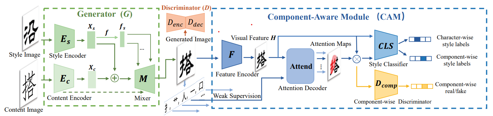
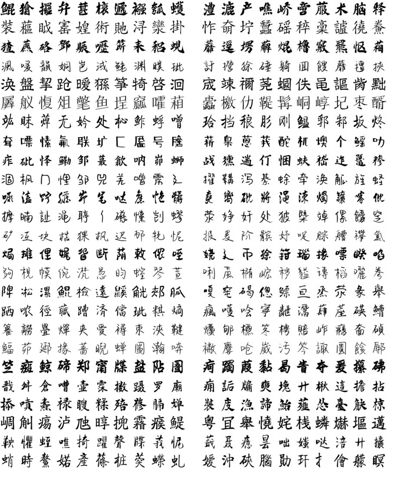

# CG-GAN(CVPR2022)

This is the official PyTorch implementation of the CVPR 2022 paper: "Look Closer to Supervise Better: One-Shot Font Generation via Component-Based Discriminator". [Arxiv Version](https://arxiv.org/abs/2205.00146)



## Introduction
  Automatic font generation remains a challenging research issue due to the large amounts of characters with complicated structures. Typically, only a few samples can serve as the style/content reference (termed few-shot learning), which further increases the difficulty to preserve local style patterns or detailed glyph structures. We investigate the drawbacks of previous studies and find that a coarse-grained discriminator is insufficient for supervising a font generator. To this end, we propose a novel Component-Aware Module (CAM), which supervises the generator to decouple content and style at a more fine-grained level, i.e., the component level. Different from previous studies struggling to increase the complexity of generators, we aim to perform more effective supervision for a relatively simple generator to achieve its full potential, which is a brand new perspective for font generation. The whole framework achieves remarkable results by coupling component-level supervision with adversarial learning, hence we call it Component-Guided GAN, shortly CG-GAN. Extensive experiments show that our approach outperforms state-of-the-art one-shot font generation methods. Furthermore, it can be applied to handwritten word synthesis and scene text image editing, suggesting the generalization of our approach.

## One-shot Chinese Font generation
<!--  -->
<div align=center></div>

## Citation
If our paper helps your research, please cite it in your publication(s):
```
@article{
  author    = {Yuxin Kong, Canjie Luo, Weihong Ma, Qiyuan Zhu, Shenggao Zhu, Nicholas Yuan, Lianwen Jin},
  title     = {Look Closer to Supervise Better: One-Shot Font Generation via Component-Based Discriminator},
  year      = {2022},
  booktitle = {Proceedings of the IEEE/CVF Conference on Computer Vision and Pattern Recognition},
  publisher = {IEEE}
}
```
